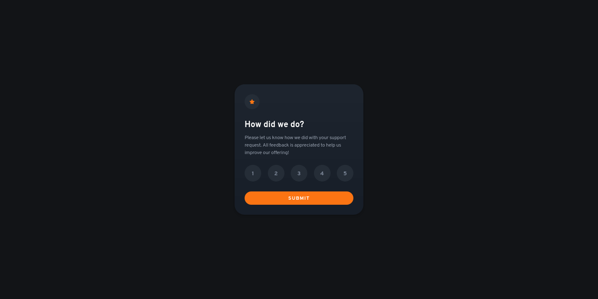
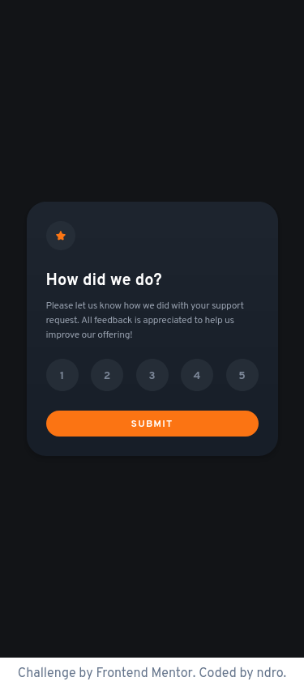
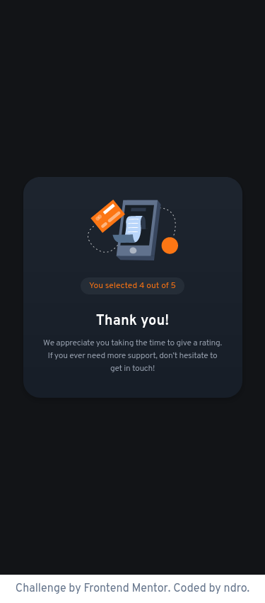

# Frontend Mentor - Interactive rating component solution with Vue 3 and Tailwind CSS

This is a solution to the [Interactive rating component challenge on Frontend Mentor](https://www.frontendmentor.io/challenges/interactive-rating-component-koxpeBUmI). 

## Table of contents

- [Overview](#overview)
  - [Screenshot](#screenshot)
  - [Links](#links)
- [My process](#my-process)
  - [Built with](#built-with)
  - [What I learned](#what-i-learned)
- [Author](#author)

## Overview

### Screenshot






### Links

- Solution URL: [Interactive rating component](https://www.frontendmentor.io/solutions/interactive-rating-component-solution-with-vue-3-and-tailwind-css-HgTqzNmEeg)
- Live Site URL: [Interactive rating component](https://ndro.github.io/interactive-rating-component/)

## My process

### Built with

- Semantic HTML5 markup
- [Vue Js](https://vuejs.org/) - JS library
  - [Vue Router](https://router.vuejs.org/) - Plugin Router
- [Tailwind CSS](https://tailwindcss.com/) - For styles
- [Vite](https://vitejs.dev/) - Build Tool

### What I learned

If we want to deploy our build to subfolder, then we have to add to router config. Here some example:
```js
const router = createRouter({
  history: createWebHistory('/interactive-rating-component')
})
```
## Author

- Frontend Mentor - [@ndro](https://www.frontendmentor.io/profile/ndro)
- Twitter - [@ndroTB](https://www.twitter.com/ndroTB)
